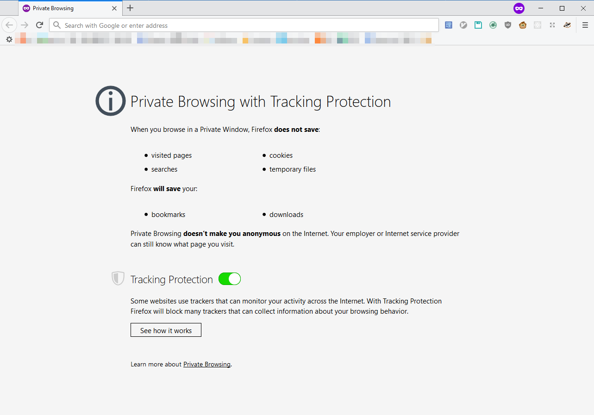
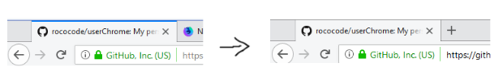

## rococo's firefox

My personal `chrome\` folder for Firefox! Contains some custom styles I've written to make Firefox prettier.

## Installation

If you'd like to use my style, first go to your Firefox profile folder.

You can get the location of your profile by navigating to `about:profiles` and opening the `Root Directory` folder.

Once in the profile folder, clone this repository with `git clone https://github.com/rococode/userChrome.git`.

(You can also just download this repo as a .zip and copy the files over.)

Rename the cloned folder from `userChrome` to `chrome`. Restart Firefox and it should be set up!

## Changes

Here is a list of changes made by my styles. This list may not be complete!

1. Private (incognito) mode light theme:

I really disliked the purple on every new tab in private mode. Here's a light re-skin! There will still be a small flicker of purple before the custom `userContent.css` kicks in, not sure how to fix that.

2. Disable blue active tab highlight:

I prefer my active tab to not have the little blue highlight above it.

